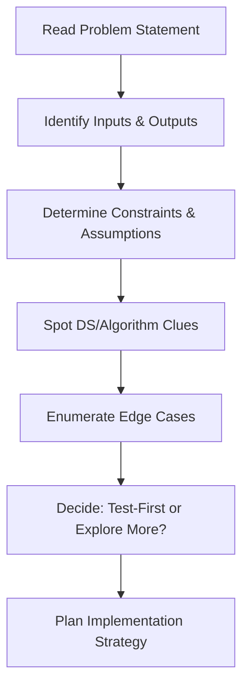
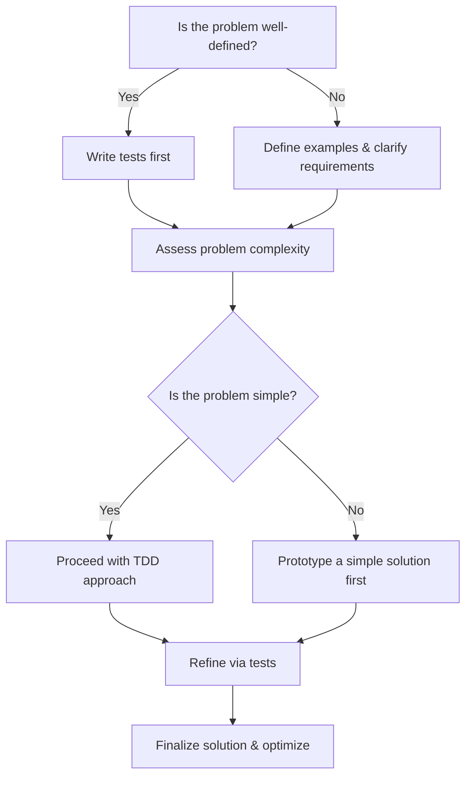
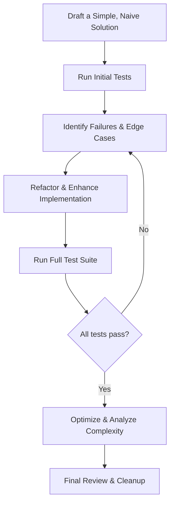
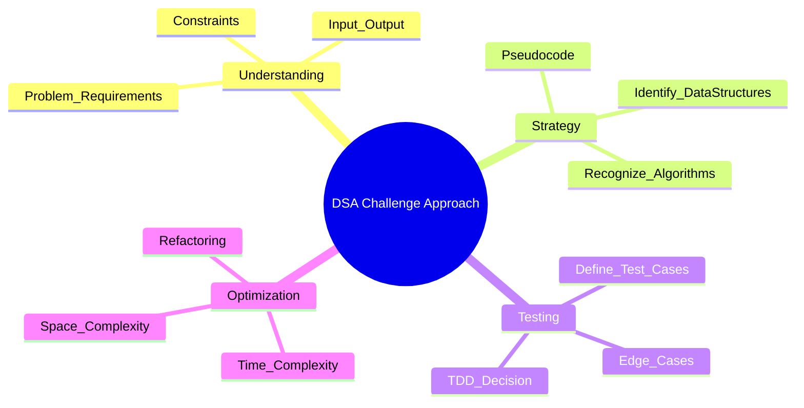
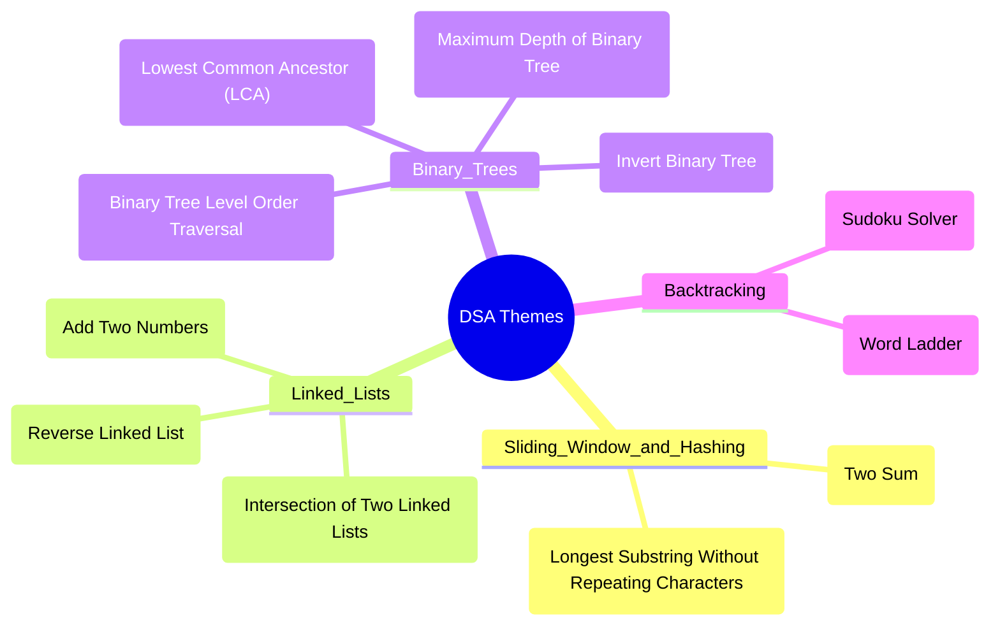
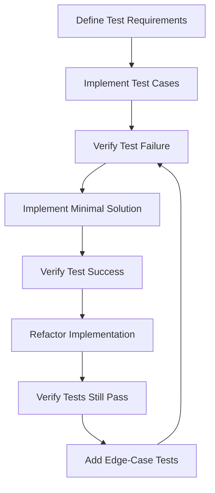
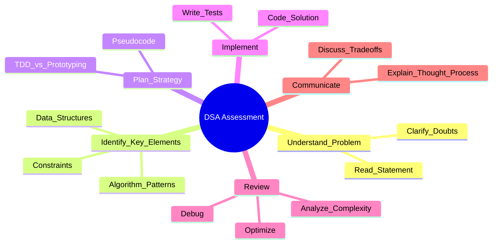

# The Definitive DSA Problem-Pattern Study Guide

## 1. Core Problem-Pattern Recognition Framework

The most efficient path to mastery is recognizing archetypal problem structures and mapping them to established solution patterns. Effective engineers develop pattern-recognition abilities that transcend memorization.

### 1.1 Pattern Recognition Table

| Problem Pattern | Characteristic Signal | Optimal Data Structure | Algorithmic Approach | Key Implementation Technique |
|-----------------|------------------------|------------------------|----------------------|------------------------------|
| Pair Finding | Finding complementary elements | Hash Map | Single-pass with lookups | Precomputation of targets |
| Sliding Window | Subarray/substring with constraints | Queue/Deque | Two-pointer technique | Window expansion/contraction |
| Tree Traversal | Hierarchical data processing | Stack/Queue | DFS/BFS | Recursive/Iterative traversal |
| Graph Search | Path-finding & connectivity | Adjacency List/Matrix | BFS/DFS/Dijkstra | Queue/Priority Queue management |
| Dynamic Programming | Overlapping subproblems | Matrix/Map | Bottom-up/Top-down | State definition & transition |
| Linked List Manipulation | Sequential data restructuring | Pointers | Multiple pointer technique | Head/tail tracking |
| Binary Search | Search space reduction | Sorted Array | Divide & Conquer | Midpoint calculation & boundary adjustments |
| Backtracking | Constraint-based permutations | Recursion Tree | DFS with pruning | State tracking with backtracking |

### 1.2 The Problem Dissection Protocol



**Critical protocol steps:**
1. Extract fundamental operation types (lookup, insertion, deletion, traversal)
2. Identify optimization metrics (time, space, specific operation efficiency)
3. Map problem characteristics to known patterns
4. Determine constraint implications on solution selection

## 2. Archetypal Problem Catalog

### 2.1 Hash-Based Solutions

#### Two Sum

**Problem Recognition:**
- Prompt: "Given an array of integers and a target, return indices of two numbers that add up to the target."
- Signal: Need to find complements—suggesting a hash table approach.
- Test-First? Yes – Clear I/O makes tests straightforward.

**Implementation Strategy:**
```python
def two_sum(nums: list[int], target: int) -> list[int]:
    """
    Find indices of two numbers that add up to target.
    
    Args:
        nums: List of integers
        target: Target sum
        
    Returns:
        List containing indices of the two numbers
        
    Time Complexity: O(n)
    Space Complexity: O(n)
    """
    complement_map = {}  # val -> index
    
    for i, num in enumerate(nums):
        complement = target - num
        if complement in complement_map:
            return [complement_map[complement], i]
        complement_map[num] = i
    
    return []  # No solution found
```

**Advanced Optimization:**
- Single-pass hash map eliminates need for sorting
- Short-circuit return reduces unnecessary iterations
- Consider handling edge cases like duplicate values

#### Longest Substring Without Repeating Characters

**Problem Recognition:**
- Prompt: "Given a string, find the length of the longest substring without repeating characters."
- Signal: The need for unique character sequences points to a sliding window or hash set.
- Test-First? Yes – Clear output criteria ease test design.

**Implementation Strategy:**
```python
def length_of_longest_substring(s: str) -> int:
    """
    Find the length of longest substring without repeating characters.
    
    Args:
        s: Input string
        
    Returns:
        Length of longest substring without repeating characters
        
    Time Complexity: O(n)
    Space Complexity: O(min(m,n)) where m is alphabet size
    """
    char_dict = {}  # char -> last position
    start = 0
    max_length = 0
    
    for end, char in enumerate(s):
        # If char already in current window, move start pointer
        if char in char_dict and char_dict[char] >= start:
            start = char_dict[char] + 1
        else:
            max_length = max(max_length, end - start + 1)
        
        char_dict[char] = end
    
    return max_length
```

**Advanced Techniques:**
- Optimize window movement by jumping start pointer
- Track maximum length during window adjustment
- Consider using array for ASCII characters instead of hash map

### 2.2 Linked List Manipulation

#### Add Two Numbers

**Problem Recognition:**
- Prompt: "You are given two non-empty linked lists representing two non-negative integers stored in reverse order. Add the two numbers and return the result as a linked list."
- Signal: Digit-by-digit addition with carries signals linked list manipulation.
- Test-First? Yes – Well-specified structure supports test-first development.

**Implementation Strategy:**
```python
class ListNode:
    def __init__(self, val=0, next=None):
        self.val = val
        self.next = next

def add_two_numbers(l1: ListNode, l2: ListNode) -> ListNode:
    """
    Add two numbers represented by linked lists.
    
    Args:
        l1: First number as linked list (reverse order)
        l2: Second number as linked list (reverse order)
        
    Returns:
        Sum as linked list (reverse order)
        
    Time Complexity: O(max(n,m))
    Space Complexity: O(max(n,m))
    """
    dummy_head = ListNode(0)
    current = dummy_head
    carry = 0
    
    while l1 or l2 or carry:
        # Get values from lists or 0 if list exhausted
        x = l1.val if l1 else 0
        y = l2.val if l2 else 0
        
        # Calculate sum and carry
        total = x + y + carry
        carry = total // 10
        
        # Create new node with digit
        current.next = ListNode(total % 10)
        current = current.next
        
        # Advance list pointers
        l1 = l1.next if l1 else None
        l2 = l2.next if l2 else None
    
    return dummy_head.next
```

**Advanced Techniques:**
- Use dummy head to simplify list construction
- Process nodes and carry in a unified loop
- Verify behavior with edge cases: different length lists, large carry

#### Reverse Linked List

**Problem Recognition:**
- Prompt: "Reverse a singly linked list."
- Signal: Pointer reversal is the key signal for this challenge.
- Test-First? Yes – The transformation is clear, enabling test-first design.

**Implementation Strategy:**
```python
def reverse_list(head: ListNode) -> ListNode:
    """
    Reverse a singly linked list.
    
    Args:
        head: Head of the linked list
        
    Returns:
        Head of the reversed linked list
        
    Time Complexity: O(n)
    Space Complexity: O(1)
    """
    prev = None
    current = head
    
    while current:
        next_temp = current.next  # Store next node
        current.next = prev       # Reverse link
        prev = current            # Move prev forward
        current = next_temp       # Move current forward
    
    return prev  # New head is the last node
```

**Advanced Techniques:**
- In-place reversal without extra memory
- Clear pointer tracking prevents orphaned nodes
- Handle edge cases: empty list, single node

#### Intersection of Two Linked Lists

**Problem Recognition:**
- Prompt: "Find the node where two singly linked lists intersect."
- Signal: Pointer techniques to detect an intersection point are revealing.
- Test-First? Yes – Specific conditions ease test formulation.

**Implementation Strategy:**
```python
def get_intersection_node(headA: ListNode, headB: ListNode) -> ListNode:
    """
    Find node where two linked lists intersect.
    
    Args:
        headA: Head of first linked list
        headB: Head of second linked list
        
    Returns:
        Intersection node or None
        
    Time Complexity: O(m+n)
    Space Complexity: O(1)
    """
    if not headA or not headB:
        return None
        
    ptrA, ptrB = headA, headB
    
    # When pointers meet, they'll be at intersection or both None
    while ptrA != ptrB:
        # When reaching end, move to beginning of other list
        ptrA = headB if ptrA is None else ptrA.next
        ptrB = headA if ptrB is None else ptrB.next
    
    return ptrA  # Either intersection node or None
```

**Advanced Techniques:**
- Elegant two-pointer approach equalizes path lengths
- Handles no-intersection case without explicit length calculation
- Minimizes memory usage with constant space complexity

### 2.3 Tree Algorithms

#### Binary Tree Level Order Traversal

**Problem Recognition:**
- Prompt: "Given a binary tree, return its level order traversal (from left to right, level by level)."
- Signal: Level-by-level breakdown hints at breadth-first search using a queue.
- Test-First? Yes – Explicit structure makes tests easy to specify.

**Implementation Strategy:**
```python
from collections import deque

class TreeNode:
    def __init__(self, val=0, left=None, right=None):
        self.val = val
        self.left = left
        self.right = right

def level_order_traversal(root: TreeNode) -> list[list[int]]:
    """
    Perform level order traversal on binary tree.
    
    Args:
        root: Root of binary tree
        
    Returns:
        List of lists, each representing one level
        
    Time Complexity: O(n)
    Space Complexity: O(n)
    """
    if not root:
        return []
        
    result = []
    queue = deque([root])
    
    while queue:
        level_size = len(queue)
        current_level = []
        
        for _ in range(level_size):
            node = queue.popleft()
            current_level.append(node.val)
            
            if node.left:
                queue.append(node.left)
            if node.right:
                queue.append(node.right)
                
        result.append(current_level)
    
    return result
```

**Advanced Techniques:**
- Queue-based BFS ensures level-by-level processing
- Track level size to correctly group nodes
- Handle empty tree case separately

#### Invert Binary Tree

**Problem Recognition:**
- Prompt: "Invert a binary tree."
- Signal: Flipping child nodes implies recursive or iterative tree traversal.
- Test-First? Yes – Direct tree transformation simplifies test-first approaches.

**Implementation Strategy:**
```python
def invert_tree(root: TreeNode) -> TreeNode:
    """
    Invert a binary tree.
    
    Args:
        root: Root of binary tree
        
    Returns:
        Root of inverted binary tree
        
    Time Complexity: O(n)
    Space Complexity: O(h) where h is tree height
    """
    if not root:
        return None
        
    # Swap children
    root.left, root.right = root.right, root.left
    
    # Recursively invert subtrees
    invert_tree(root.left)
    invert_tree(root.right)
    
    return root
```

**Advanced Techniques:**
- Clean recursive solution with minimal code
- Bottom-up tree transformation via post-order traversal
- Consider iterative implementation for tall trees

#### Lowest Common Ancestor (LCA)

**Problem Recognition:**
- Prompt: "Given a binary tree and two nodes, find the lowest common ancestor (LCA)."
- Signal: Tree traversal with backtracking reveals the LCA pattern.
- Test-First? Yes – Specific tree scenarios can be designed as tests.

**Implementation Strategy:**
```python
def lowest_common_ancestor(root: TreeNode, p: TreeNode, q: TreeNode) -> TreeNode:
    """
    Find lowest common ancestor of two nodes in binary tree.
    
    Args:
        root: Root of binary tree
        p: First node
        q: Second node
        
    Returns:
        Lowest common ancestor node
        
    Time Complexity: O(n)
    Space Complexity: O(h) where h is tree height
    """
    # Base case
    if not root or root == p or root == q:
        return root
        
    # Recursive search in subtrees
    left = lowest_common_ancestor(root.left, p, q)
    right = lowest_common_ancestor(root.right, p, q)
    
    # If both left and right return values, root is LCA
    if left and right:
        return root
        
    # Otherwise, return non-null result
    return left if left else right
```

**Advanced Techniques:**
- Elegant post-order traversal solution
- Handles cases where nodes are in same subtree
- Solution works for both BST and general binary trees

### 2.4 Advanced Algorithmic Patterns

#### Search in Rotated Sorted Array

**Problem Recognition:**
- Prompt: "Search in a rotated sorted array for a target value and return its index or -1 if not found."
- Signal: A modified binary search due to rotation signals specialized pivot logic.
- Test-First? Yes – Precise boundary conditions favor test-first design.

**Implementation Strategy:**
```python
def search_rotated(nums: list[int], target: int) -> int:
    """
    Search for target in rotated sorted array.
    
    Args:
        nums: Rotated sorted array
        target: Value to search for
        
    Returns:
        Index of target or -1 if not found
        
    Time Complexity: O(log n)
    Space Complexity: O(1)
    """
    if not nums:
        return -1
        
    left, right = 0, len(nums) - 1
    
    while left <= right:
        mid = (left + right) // 2
        
        if nums[mid] == target:
            return mid
        
        # Check if left half is sorted
        if nums[left] <= nums[mid]:
            # Check if target is in left sorted half
            if nums[left] <= target < nums[mid]:
                right = mid - 1
            else:
                left = mid + 1
        # Right half is sorted
        else:
            # Check if target is in right sorted half
            if nums[mid] < target <= nums[right]:
                left = mid + 1
            else:
                right = mid - 1
    
    return -1
```

**Advanced Techniques:**
- Identify sorted partition in each iteration
- Leverage sorted partition for target comparison
- Carefully handle array rotation and equality cases

#### Sudoku Solver

**Problem Recognition:**
- Prompt: "Write a program to solve a Sudoku puzzle by filling the empty cells."
- Signal: Constraint propagation with backtracking points strongly to a recursive solution.
- Test-First? No – Define constraints and edge-case behaviors before tests.

**Implementation Strategy:**
```python
def solve_sudoku(board: list[list[str]]) -> None:
    """
    Solve a Sudoku puzzle by filling empty cells.
    
    Args:
        board: 9x9 Sudoku board with '.' as empty cells
        
    Modifies the board in-place.
    
    Time Complexity: O(9^(n*n)) worst case, where n is board width
    Space Complexity: O(n*n) for recursion stack
    """
    n = len(board)
    
    def is_valid(row: int, col: int, num: str) -> bool:
        # Check row
        for x in range(n):
            if board[row][x] == num:
                return False
                
        # Check column
        for x in range(n):
            if board[x][col] == num:
                return False
                
        # Check 3x3 box
        box_row, box_col = 3 * (row // 3), 3 * (col // 3)
        for i in range(3):
            for j in range(3):
                if board[box_row + i][box_col + j] == num:
                    return False
                    
        return True
    
    def backtrack() -> bool:
        # Find empty cell
        for row in range(n):
            for col in range(n):
                if board[row][col] == '.':
                    # Try digits 1-9
                    for num in map(str, range(1, 10)):
                        if is_valid(row, col, num):
                            # Place valid digit
                            board[row][col] = num
                            
                            # Recursively solve rest of board
                            if backtrack():
                                return True
                                
                            # If failed, backtrack
                            board[row][col] = '.'
                            
                    # No valid digit found
                    return False
        
        # All cells filled
        return True
    
    backtrack()
```

**Advanced Techniques:**
- Recursive backtracking with constraint validation
- Early pruning of invalid placements
- Consider optimizations: validity checking, cell selection order

## 3. Implementation Methodology

### 3.1 Test-Driven Development Framework



**Implementation of TDD for DSA challenges:**

1. **Define the contract** - Specify inputs, outputs, and exceptions
2. **Write test cases** - Cover normal cases, edge cases, and error conditions
3. **Implement minimally** - Write just enough code to pass tests
4. **Refactor** - Improve implementation while maintaining test coverage
5. **Optimize** - Address performance concerns with benchmarks

### 3.2 Iterative Solution Refinement



**Refinement protocol:**

1. Begin with the simplest working implementation
2. Identify edge cases and stress conditions
3. Refine algorithm to handle all scenarios
4. Analyze complexity and optimize bottlenecks
5. Document optimization decisions and trade-offs

## 4. Algorithmic Patterns Mind Map



### 4.1 Common Algorithm Patterns

#### Sliding Window Pattern

**Applications:**
- Subarray/substring problems with constraints
- Consecutive sequence optimization
- Stream processing with fixed or variable window

**Implementation template:**
```python
def sliding_window_pattern(arr: list, k: int) -> int:
    """
    Sliding window template for fixed-size window.
    
    Args:
        arr: Input array
        k: Window size
        
    Returns:
        Maximum sum of any window
    """
    window_sum = sum(arr[:k])
    max_sum = window_sum
    
    for i in range(k, len(arr)):
        # Slide window: add new element, remove leaving element
        window_sum += arr[i] - arr[i - k]
        max_sum = max(max_sum, window_sum)
    
    return max_sum
```

#### Two-Pointer Technique

**Applications:**
- Pair finding problems
- Palindrome verification
- Container/interval maximization

**Implementation template:**
```python
def two_pointer_pattern(arr: list) -> list:
    """
    Two-pointer approach for array manipulation.
    
    Args:
        arr: Sorted input array
        
    Returns:
        Array with duplicates removed
    """
    if not arr:
        return []
        
    # Initialize slow pointer
    slow = 0
    
    # Fast pointer scans array
    for fast in range(1, len(arr)):
        # When elements differ, move slow pointer and update
        if arr[fast] != arr[slow]:
            slow += 1
            arr[slow] = arr[fast]
    
    # Return array up to slow+1 length (includes first element)
    return arr[:slow + 1]
```

#### Binary Search Variations

**Applications:**
- Sorted array search
- Rotated array search
- Search space reduction

**Implementation template:**
```python
def binary_search_template(arr: list, target: int) -> int:
    """
    Binary search template with left bias.
    
    Args:
        arr: Sorted input array
        target: Value to find
        
    Returns:
        Index of leftmost occurrence or -1
    """
    left, right = 0, len(arr) - 1
    
    while left <= right:
        mid = left + (right - left) // 2  # Avoid overflow
        
        if arr[mid] < target:
            left = mid + 1
        else:
            # Using right = mid - 1 even when equal
            # creates left-biased search
            right = mid - 1
    
    # Check if left is in bounds and contains target
    if left < len(arr) and arr[left] == target:
        return left
    
    return -1
```

## 5. Comprehensive DSA Thematic Classification



### 5.1 Extended Problem Classification

| DSA Category | Sub-pattern | Representative Problems | Key Implementation Technique |
|--------------|-------------|------------------------|------------------------------|
| Array Manipulation | Two Pointers | Container With Most Water, 3Sum | Converging pointers with pruning |
| Array Manipulation | Sliding Window | Longest Substring Without Repeating Characters | Dynamic window adjustment |
| Array Manipulation | Prefix Sums | Subarray Sum Equals K | Cumulative sums with hash map |
| Tree Algorithms | DFS | Path Sum, Binary Tree Maximum Path Sum | Recursive depth-first traversal |
| Tree Algorithms | BFS | Level Order Traversal, Zigzag Level Order Traversal | Queue-based breadth-first traversal |
| Tree Algorithms | Tree Construction | Construct Binary Tree from Preorder/Inorder | Recursive subdivision with index mapping |
| Graph Algorithms | DFS | Number of Islands, Clone Graph | Recursive/Iterative DFS with visited tracking |
| Graph Algorithms | BFS | Word Ladder, Shortest Path | Queue-based BFS with level tracking |
| Graph Algorithms | Topological Sort | Course Schedule, Alien Dictionary | DFS with cycle detection |
| Dynamic Programming | 1D Optimization | Climbing Stairs, House Robber | State transitions with memoization |
| Dynamic Programming | 2D Grid | Unique Paths, Minimum Path Sum | 2D state matrix with optimal substructure |
| Dynamic Programming | String Operations | Edit Distance, Longest Common Subsequence | String alignment with table construction |

## 6. Test-Driven Development Implementation

### 6.1 Testing Infrastructure Framework

The strategic implementation of test-driven development requires a systematic approach to test infrastructure:



#### Structured Test Development Evolution

The iterative development of test-driven solutions follows a predictable pattern of increasing sophistication:

**Stage 1: Initial Test Framework**
```python
import unittest

class TestTwoSum(unittest.TestCase):
    def test_basic_case(self):
        """Test the two_sum function with a simple valid input."""
        self.assertEqual(two_sum([2, 7, 11, 15], 9), [0, 1])
    
if __name__ == "__main__":
    unittest.main()
```

**Stage 2: Implementation Stub**
```python
def two_sum(nums, target):
    """
    Find indices of two numbers that add up to target.
    
    Args:
        nums: List of integers
        target: Target sum
        
    Returns:
        List containing indices of the two numbers
    """
    # Placeholder implementation
    return []
```

**Stage 3: Comprehensive Test Suite**
```python
import unittest
from two_sum import two_sum

class TestTwoSum(unittest.TestCase):
    def test_basic_case(self):
        """Test with a simple valid input."""
        self.assertEqual(two_sum([2, 7, 11, 15], 9), [0, 1])
    
    def test_alternative_order(self):
        """Test with numbers not in sorted order."""
        result = two_sum([3, 2, 4], 6)
        self.assertIn(result, [[1, 2], [2, 1]])
    
    def test_duplicate_numbers(self):
        """Test with duplicate numbers in the array."""
        self.assertEqual(two_sum([3, 3], 6), [0, 1])
    
    def test_negative_numbers(self):
        """Test with negative numbers in the array."""
        result = two_sum([-1, -2, -3, -4, -5], -8)
        self.assertIn(result, [[2, 4], [4, 2]])
    
    def test_no_solution(self):
        """Test when no solution exists."""
        self.assertEqual(two_sum([1, 2, 3], 7), [])
    
    def test_zero_sum(self):
        """Test with zero as the target sum."""
        result = two_sum([-1, 0, 1], 0)
        self.assertIn(result, [[0, 2], [2, 0]])
    
    def test_large_array(self):
        """Test with a larger array to check performance."""
        large_array = list(range(10000))
        large_array[5000] = 5
        large_array[9000] = 9995
        result = two_sum(large_array, 10000)
        self.assertIn(result, [[5000, 9000], [9000, 5000]])

if __name__ == "__main__":
    unittest.main()
```

**Stage 4: Initial Implementation**
```python
def two_sum(nums, target):
    """
    Find indices of two numbers that add up to target.
    
    Args:
        nums: List of integers
        target: Target sum
        
    Returns:
        List containing indices of the two numbers
        
    Time Complexity: O(n)
    Space Complexity: O(n)
    """
    complement_map = {}  # value -> index
    
    for i, num in enumerate(nums):
        complement = target - num
        if complement in complement_map:
            return [complement_map[complement], i]
        complement_map[num] = i
    
    return []  # No solution found
```

**Stage 5: Optimized Implementation with Performance Analysis**
```python
def two_sum(nums, target):
    """
    Find indices of two numbers that add up to target.
    
    Args:
        nums: List of integers
        target: Target sum
        
    Returns:
        List containing indices of the two numbers
        
    Time Complexity: O(n)
    Space Complexity: O(n)
    """
    if not nums or len(nums) < 2:
        return []
    
    # Early optimization: if array is too small
    if len(nums) == 2:
        return [0, 1] if nums[0] + nums[1] == target else []
    
    complement_map = {}  # value -> index
    
    for i, num in enumerate(nums):
        complement = target - num
        if complement in complement_map:
            return [complement_map[complement], i]
        complement_map[num] = i
    
    return []  # No solution found
```

#### Test Execution Tools and Reporting

Strategic test execution incorporates automated tools for consistent quality:

```python
# test_runner.py
import unittest
import time
import sys
from io import StringIO
from contextlib import redirect_stdout

def run_tests(test_module):
    """
    Run tests with detailed reporting.
    
    Args:
        test_module: Module containing unittest test cases
    """
    # Capture start time
    start_time = time.time()
    
    # Create test suite and runner
    loader = unittest.TestLoader()
    suite = loader.loadTestsFromModule(test_module)
    
    # Capture output
    output = StringIO()
    with redirect_stdout(output):
        result = unittest.TextTestRunner(verbosity=2).run(suite)
    
    # Execution time
    execution_time = time.time() - start_time
    
    # Generate report
    passed = result.testsRun - (len(result.errors) + len(result.failures))
    
    print(f"\n{'=' * 50}")
    print(f"TEST EXECUTION REPORT")
    print(f"{'=' * 50}")
    print(f"Total tests: {result.testsRun}")
    print(f"Passed: {passed}")
    print(f"Failed: {len(result.failures)}")
    print(f"Errors: {len(result.errors)}")
    print(f"Execution time: {execution_time:.4f} seconds")
    print(f"{'=' * 50}")
    
    # Show failed tests with details
    if result.failures or result.errors:
        print("\nFAILED TESTS:")
        for test, error in result.failures:
            print(f"\n{test}")
            print(f"ERROR: {error}")
        
        for test, error in result.errors:
            print(f"\n{test}")
            print(f"ERROR: {error}")
    
    return passed == result.testsRun

if __name__ == "__main__":
    import test_two_sum
    success = run_tests(test_two_sum)
    sys.exit(0 if success else 1)
```

### 6.2 Test Case Strategy Framework

A rigorous test-driven development approach requires systematic test case formulation:

| Test Case Category | Purpose | Implementation Strategy | Validation Approach |
|-------------------|---------|-------------------------|---------------------|
| Happy Path | Verify primary functionality | Use typical valid inputs | Assert expected output exactly |
| Edge Cases | Test boundary conditions | Zero values, empty inputs, minimal valid inputs | Assert handling of special conditions |
| Error Cases | Validate error handling | Invalid, malformed, or illegal inputs | Assert appropriate error responses |
| Performance Cases | Evaluate efficiency | Large inputs, worst-case scenarios | Assert time-bounded execution |
| Regression Cases | Prevent reintroduction of fixed bugs | Previously failed inputs | Assert correct handling of specific inputs |

#### Case Study: Test Suite for Binary Search

```python
import unittest
from binary_search import binary_search

class TestBinarySearch(unittest.TestCase):
    def test_empty_array(self):
        """Test with an empty array."""
        self.assertEqual(binary_search([], 5), -1)
    
    def test_single_element_found(self):
        """Test with a single-element array, element found."""
        self.assertEqual(binary_search([5], 5), 0)
    
    def test_single_element_not_found(self):
        """Test with a single-element array, element not found."""
        self.assertEqual(binary_search([5], 10), -1)
    
    def test_multiple_elements_found_start(self):
        """Test with multiple elements, target at start."""
        self.assertEqual(binary_search([1, 2, 3, 4, 5], 1), 0)
    
    def test_multiple_elements_found_middle(self):
        """Test with multiple elements, target in middle."""
        self.assertEqual(binary_search([1, 2, 3, 4, 5], 3), 2)
    
    def test_multiple_elements_found_end(self):
        """Test with multiple elements, target at end."""
        self.assertEqual(binary_search([1, 2, 3, 4, 5], 5), 4)
    
    def test_multiple_elements_not_found_below_range(self):
        """Test with multiple elements, target below range."""
        self.assertEqual(binary_search([1, 2, 3, 4, 5], 0), -1)
    
    def test_multiple_elements_not_found_above_range(self):
        """Test with multiple elements, target above range."""
        self.assertEqual(binary_search([1, 2, 3, 4, 5], 6), -1)
    
    def test_multiple_elements_not_found_within_range(self):
        """Test with multiple elements, target within range but not present."""
        self.assertEqual(binary_search([1, 3, 5, 7, 9], 4), -1)
    
    def test_duplicate_elements_found(self):
        """Test with duplicate elements, target found multiple times."""
        # By convention, return first occurrence
        self.assertEqual(binary_search([1, 2, 2, 2, 3], 2), 1)
    
    def test_large_array(self):
        """Test with a large array, target in middle."""
        large_array = list(range(0, 10000, 2))  # Even numbers 0-9998
        self.assertEqual(binary_search(large_array, 5000), 2500)
    
    def test_very_large_array(self):
        """Test with a very large array to validate performance."""
        # This test ensures logarithmic performance is maintained
        very_large_array = list(range(0, 1000000))
        start_time = time.time()
        result = binary_search(very_large_array, 999999)
        execution_time = time.time() - start_time
        self.assertEqual(result, 999999)
        self.assertLess(execution_time, 0.01)  # Should be very fast

if __name__ == "__main__":
    unittest.main()
```

### 6.3 Progressive Test Development

The implementation of test-driven development evolves through distinct phases, each adding value:

**Phase 1: Specification Tests**
Focus on documenting requirements through tests before implementation begins.

```python
def test_specifications():
    """
    Run assertion tests based on functional specifications.
    These initial tests define requirements before implementation.
    """
    # Interface contract validation
    assert callable(two_sum), "two_sum should be a callable function"
    
    # Input parameter validation
    try:
        two_sum([], 0)  # Should accept empty array
        two_sum([1], 1)  # Should accept single-element array
        two_sum([1, 2], 3)  # Should accept multi-element array
    except Exception as e:
        assert False, f"two_sum should accept valid inputs: {str(e)}"
    
    # Output contract validation
    result = two_sum([2, 7, 11, 15], 9)
    assert isinstance(result, list), "Output should be a list"
    assert all(isinstance(x, int) for x in result), "Output should contain integers"
```

**Phase 2: Behavioral Tests**
Extend testing to validate behavior across various scenarios.

```python
def test_behavior():
    """
    Test the function's behavior across different scenarios.
    These tests ensure the implementation meets requirements.
    """
    # Basic functionality
    assert two_sum([2, 7, 11, 15], 9) == [0, 1], "Should find correct indices"
    
    # Edge cases
    assert two_sum([], 1) == [], "Empty array should return empty result"
    assert two_sum([1], 1) == [], "Single element can't sum with itself"
    
    # No solution exists
    assert two_sum([1, 2, 3], 10) == [], "Should return empty list when no solution"
    
    # Multiple potential solutions (only need to return one)
    result = two_sum([3, 2, 4, 3], 6)
    assert result in ([0, 3], [3, 0], [1, 2], [2, 1]), "Should find a valid solution"
```

**Phase 3: Implementation Tests**
Comprehensive tests that validate the full implementation including optimizations.

```python
class TestTwoSumImplementation(unittest.TestCase):
    """
    Comprehensive test suite for the two_sum implementation.
    """
    
    def test_correctness(self):
        """Test basic correctness across various inputs."""
        test_cases = [
            {"input": {"nums": [2, 7, 11, 15], "target": 9}, "expected": [0, 1]},
            {"input": {"nums": [3, 2, 4], "target": 6}, "expected": [1, 2]},
            {"input": {"nums": [3, 3], "target": 6}, "expected": [0, 1]},
            {"input": {"nums": [1, 2, 3, 4, 5], "target": 9}, "expected": [3, 4]},
            {"input": {"nums": [-1, -2, -3, -4, -5], "target": -8}, "expected": [2, 4]}
        ]
        
        for case in test_cases:
            result = two_sum(**case["input"])
            self.assertEqual(result, case["expected"])
    
    def test_no_solution(self):
        """Test cases where no solution exists."""
        no_solution_cases = [
            {"nums": [1, 2, 3], "target": 10},
            {"nums": [], "target": 5},
            {"nums": [5], "target": 5}
        ]
        
        for case in no_solution_cases:
            self.assertEqual(two_sum(**case), [])
    
    def test_performance(self):
        """Test performance on large inputs."""
        # Generate large test case
        large_array = list(range(100000))
        large_array[50000] = 1
        large_array[99999] = 100000
        
        # Measure execution time
        start_time = time.time()
        result = two_sum(large_array, 100001)
        execution_time = time.time() - start_time
        
        # Verify correctness
        self.assertEqual(result, [50000, 99999])
        
        # Verify performance (should be fast with hash map)
        self.assertLess(execution_time, 0.1, 
                         "Implementation should handle large arrays efficiently")
```

## 7. Communication Framework for Technical Interviews

### 7.1. Assessment Mental Model



### 7.2 Technical Communication Protocol

1. **Problem Understanding Phase**
   - Restate the problem in your own words
   - Ask clarifying questions about edge cases
   - Confirm input/output specifications

2. **Solution Design Phase**
   - Explain high-level approach
   - Discuss data structure selection rationale
   - Present algorithm with pseudocode

3. **Complexity Analysis**
   - Analyze time complexity with justification
   - Discuss space requirements
   - Identify optimization opportunities

4. **Implementation Narration**
   - Explain key implementation decisions
   - Highlight edge case handling
   - Discuss alternative approaches considered

## 8. Advanced DSA Problem Reference Table

| Often Seen Prompt | Challenge Name | What Gives Away the DSA | Should I Write the Test First? | Key Learning / Advanced Tips |
|-------------------|----------------|-------------------------|--------------------------------|------------------------------|
| "Given an array of integers and a target, return indices of two numbers that add up to the target." | Two Sum | Need to find complements—suggesting a hash table approach. | Yes – Clear I/O makes tests straightforward. | Master optimal hash-based solutions; consider edge cases like duplicates, negatives, and multiple pairs. |
| "You are given two non-empty linked lists representing two non-negative integers stored in reverse order. Add the two numbers and return the result as a linked list." | Add Two Numbers | Digit-by-digit addition with carries signals linked list manipulation. | Yes – Well-specified structure supports test-first development. | Hone pointer manipulation and carry management; watch out for differing list lengths and end-of-list carry. |
| "Given a string, find the length of the longest substring without repeating characters." | Longest Substring Without Repeating Characters | The need for unique character sequences points to a sliding window or hash set. | Yes – Clear output criteria ease test design. | Practice optimizing sliding window techniques; be precise with window adjustments for maximal efficiency. |
| "Given two sorted arrays, find the median of the two sorted arrays." | Median of Two Sorted Arrays | Sorted arrays hint at advanced binary search/partitioning. | No – Clarify edge cases and specification details first. | Focus on divide & conquer approaches; study partitioning strategies that handle unequal array sizes and empty arrays. |
| "Given a string, return the longest palindromic substring in it." | Longest Palindromic Substring | The symmetry requirement often leads to dynamic programming or center expansion. | Yes – A clear expected outcome permits early testing. | Explore both DP and expand-around-center techniques; differentiate handling for odd and even lengths. |
| "Given n non-negative integers representing heights, find two lines that form a container with the most water." | Container With Most Water | Maximizing area with a two-pointer technique is the key indicator. | Yes – Input/output behavior is unambiguous. | Deeply understand the two-pointer approach; study why and how pointers converge and manage edge-case scenarios. |
| "Given a string containing just the characters '(', ')', '{', '}', '[' and ']', determine if it is valid." | Valid Parentheses | Matching pairs clearly lead to a stack-based solution. | Yes – The validation rules allow immediate test creation. | Master stack operations and mapping of opening/closing pairs; consider nuances such as early termination on mismatch. |
| "Given a collection of intervals, merge all overlapping intervals." | Merge Intervals | Sorting and merging overlapping intervals is a giveaway. | Yes – Expected merged intervals simplify test writing. | Focus on sorting techniques and carefully checking overlap conditions; consider edge cases with adjacent intervals. |
| "Given a binary tree, return its level order traversal (from left to right, level by level)." | Binary Tree Level Order Traversal | Level-by-level breakdown hints at breadth-first search using a queue. | Yes – Explicit structure makes tests easy to specify. | Develop robust BFS implementations; get comfortable with edge handling (e.g., null nodes) and varied tree shapes. |
| "Invert a binary tree." | Invert Binary Tree | Flipping child nodes implies recursive or iterative tree traversal. | Yes – Direct tree transformation simplifies test-first approaches. | Focus on both recursive and iterative strategies; ensure base cases are well-handled to avoid stack overflow. |
| "Given a binary tree, find its maximum depth." | Maximum Depth of Binary Tree | Recursion for depth computation is apparent. | Yes – Clear output metrics support early tests. | Deepen understanding of recursion; learn to efficiently traverse trees while avoiding redundant computations. |
| "Given a binary tree, determine if it is height-balanced." | Balanced Binary Tree | Comparing subtree heights signals recursive balance checking. | Yes – Balance criteria are straightforward for tests. | Study efficient recursion strategies that combine height calculation with balance checking; practice optimizing to avoid recomputation. |
| "Given a binary tree and two nodes, find the lowest common ancestor (LCA)." | Lowest Common Ancestor (LCA) of a Binary Tree | Tree traversal with backtracking reveals the LCA pattern. | Yes – Specific tree scenarios can be designed as tests. | Explore recursive solutions for both BSTs and general trees; familiarize yourself with iterative approaches using parent pointers. |
| "Design an algorithm to serialize and deserialize a binary tree." | Serialize and Deserialize Binary Tree | Tree traversal and encoding signal a more complex, customizable approach. | No – Refine the problem requirements before testing. | Understand various tree traversal orders for serialization; consider how to best represent null nodes and preserve tree structure. |
| "Given a linked list, determine if it contains a cycle." | Linked List Cycle | The fast/slow pointer technique is the primary giveaway. | Yes – Defined behavior aids in writing explicit tests. | Master the two-pointer cycle detection method; study cases that include self-loops and immediate cycles. |
| "Reverse a singly linked list." | Reverse Linked List | Pointer reversal is the key signal for this challenge. | Yes – The transformation is clear, enabling test-first design. | Focus on in-place reversal strategies; compare iterative and recursive approaches, and handle corner cases like empty or single-element lists. |
| "Merge two sorted linked lists into one sorted list." | Merge Two Sorted Lists | The merging process is similar to merge sort's combine step. | Yes – Clearly defined inputs and expected order make tests intuitive. | Practice iterative merging; ensure stability and correctness by managing pointer transitions effectively. |
| "Find the node where two singly linked lists intersect." | Intersection of Two Linked Lists | Pointer techniques to detect an intersection point are revealing. | Yes – Specific conditions ease test formulation. | Understand pointer alignment strategies and list length differences; optimize to reduce time complexity while ensuring robustness. |
| "Design a stack that supports push, pop, top, and retrieving the minimum element in constant time." | Min Stack | Augmented data structures hint at auxiliary tracking of the minimum. | Yes – The function contract is precise enough for test-first. | Study approaches that use auxiliary stacks or modified node structures; ensure constant-time operations under all scenarios. |
| "Design and implement a data structure for a Least Recently Used (LRU) cache." | LRU Cache | The need for fast lookups and eviction order points to hash maps combined with doubly linked lists. | Yes – Clearly defined operations make test-first ideal. | Master the integration of hash maps with doubly-linked lists; prepare for follow-up questions regarding concurrency and scalability. |
| "Given two words (beginWord and endWord) and a dictionary, find the length of the shortest transformation sequence." | Word Ladder | The single-letter transformation process highlights a graph/BFS approach. | No – Clarify transformation rules and edge cases prior to tests. | Focus on graph traversal and level tracking; study the performance impact of large dictionaries and repeated word transformations. |
| "Find the kth largest element in an unsorted array." | Kth Largest Element in an Array | The selection aspect hints at using heaps or Quickselect. | Yes – Once constraints are understood, tests can drive implementation. | Master both heap-based and partition-based selection methods; analyze average vs. worst-case complexity trade-offs. |
| "Merge k sorted linked lists and return a single sorted list." | Merge k Sorted Lists | Merging multiple lists typically indicates the use of a min-heap or divide and conquer. | Yes – Once clarified, test cases can be built around efficiency and correctness. | Learn strategies for multi-list merging using heaps and iterative pairwise merging; focus on managing complexity and minimizing runtime. |
| "Search in a rotated sorted array for a target value and return its index or -1 if not found." | Search in Rotated Sorted Array | A modified binary search due to rotation signals specialized pivot logic. | Yes – Precise boundary conditions favor test-first design. | Study the adjustments needed in binary search when dealing with rotation; pay particular attention to pivot identification and edge conditions. |
| "Write a program to solve a Sudoku puzzle by filling the empty cells." | Sudoku Solver | Constraint propagation with backtracking points strongly to a recursive solution. | No – Define constraints and edge-case behaviors before tests. | Emphasize backtracking and search space pruning; learn to efficiently check constraints at each step and optimize recursion. |
